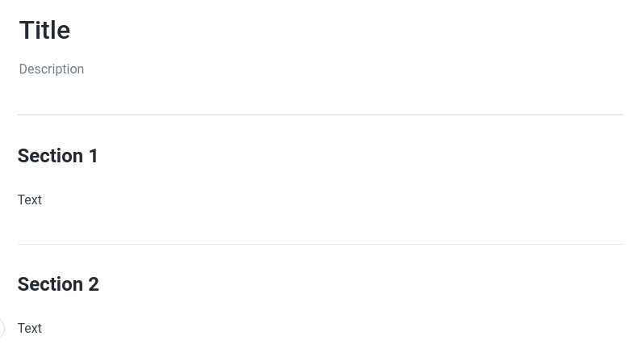

# Contribute

## How to Contribute

You can contribute to minehut.xyz by making a [pull request at our GitHub](https://github.com/TeamMH/minehutxyz).
You will need a GitHub account for this.

## How to make a pull request

To make a pull request, you need to make a fork of the Minehut XYZ repository.

To fork the repository, click the `Fork` button at the top right of the page.

A category is just a folder with the name of the category, navigate to the category you want to add a page to. From here, click `Add file`, and then `Create new file`. Create a file with a short name, and put `.md` after the name, (ex. `functions.md`, `download-world.md`, etc.), and then open the file.

From here, you can edit the file.



This is an example page, and this is the source:

```
---
description: Description
---

# Title

## Section 1

Text

## Section 2

Text
```

To add a **description** to your page, add: ```
---
description: Description for your page!
---
```

To add a **title** to your page, add: ```
# title for your page
```

To add separate sections for your page, add:
```
## Section

Put text here
```

You can, of course, put normal markdown in your page aswell.
Once you're done making the page, click `Commit new file`.

Now, for Gitbook to register the page, open a file named SUMMARY.md, and then find the category you're adding a page to, and then under it, put `* [Title of your page](category/file-name.md)`. Then commit the file.

Now you can make a pull request!
Go to your repository, then click the button labeled `Pull request`, it should be right next to a `Compare` button. Then, click `Create pull request`. Tada! You have made a pull request to our repository, and your page will appear on the Gitbook if we accept it.
